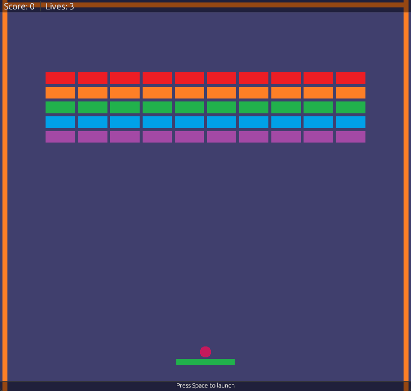
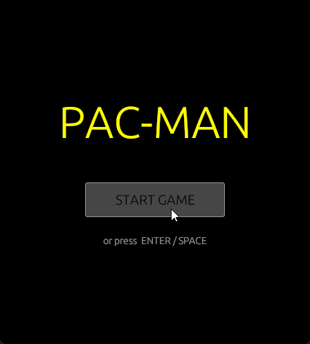

# MithyaEngine

A 2D game engine built from scratch in Rust. Ships real games.





---

## Games

**Brickbreaker** — collision layers, physics, velocity reflection, bounce dynamics.

**Pac-Man** — grid-based A* pathfinding, multi-agent navigation, ghost AI, input system.

---

## Architecture

### ECS
Entities are plain `u32` IDs. Components are data structs. Systems operate on entities that match a component set. No inheritance — behaviour comes from composition. Component storage uses contiguous archetype-aligned `Vec` columns for cache-friendly iteration.

### Event / Action Pipeline
Systems communicate through two channels: events (facts about what happened) and actions (deferred world mutations). The split exists because the borrow checker cannot allow mutable world access during system reads — so mutations are deferred to a point where no borrows are active.

```
handle_event_all() → listeners receive read-only &World, push actions
execute_all()      → actions mutate world
update_all()       → systems update, may push events for next frame
```

This isn't a workaround — it's a cleaner architecture. Mid-frame mutation bugs are structurally impossible.

### Navigation
`NavGrid` is a uniform cell grid resource with Floor/Wall types. Exposes A* pathfinding and bidirectional cell↔world coordinate conversion. `NavAgent` components carry path queues; `NavigationSystem` listens for `MoveToEvent`, runs A*, and steps agents along their path each frame — feeding into the existing movement pipeline with no engine-loop special-casing.

```rust
let path = nav_grid.find_path(start_cell, goal_cell);
let cell = nav_grid.world_to_cell(world_pos);
```

### Collision Layers
Colliders carry a `layer` (what they are) and `mask` (what they collide with) as `u32` bitmasks — 32 layers available. Two entities only run collision if their layer/mask pairs intersect, eliminating spurious same-type checks.

```rust
pub const LAYER_WALL:   u32 = 0b0001;
pub const LAYER_BALL:   u32 = 0b0010;
pub const LAYER_PADDLE: u32 = 0b0100;
pub const LAYER_BRICK:  u32 = 0b1000;

// Wall only collides with ball — never with other walls
Collider { layer: LAYER_WALL, mask: LAYER_BALL, .. }
```

### Input
Named actions bound to physical keys via `InputMapping` resource. `InputSystem` translates raw key events into `InputActionEvent` — systems respond to actions, not keycodes. Rebinding is a config change, not a code change. `Continuous` mode fires every frame while held; `OneShot` fires once on press.

### Camera
A `Camera` component on any entity drives the view. `RenderingSystem` finds the active camera each frame and derives view/projection matrices from it — no hardcoded values. Aspect ratio is computed from window dimensions automatically.

### Resources
Global data lives in a typed `Resources` store keyed by type, not name. `World` stays lean — only `EntityManager` and `AssetManager` live on it directly. Adding new global state never touches the `World` struct.

### Rendering
Built on `wgpu` (Vulkan/DX12/Metal/WebGPU). Shaders in WGSL. `RenderingSystem` owns all wgpu state and is called directly from the engine loop. UI via `egui` rendered on top of the main pass — games register a draw closure that executes every frame with read access to world state.

### Physics
Velocity, acceleration, drag, gravity, bounce, max speed. Collision resolution uses relative velocity reflection to preserve ball speed regardless of what it hits.

---

## Stack

`wgpu` · `winit` · `egui` · `glam` · `serde` · `bytemuck` · `image` · `thiserror`